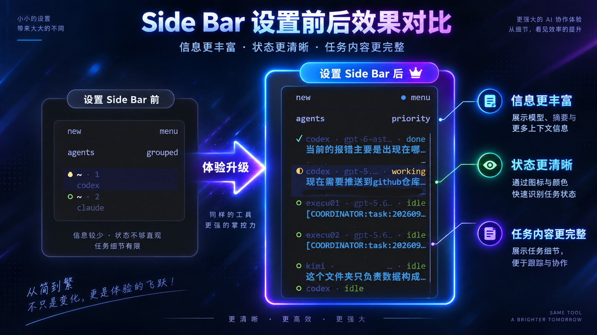

# Herdr CLI Adapters

[English](README.md) | 简体中文

为 Herdr 提供各类 CLI 编程代理适配器，在 sidebar 中显示代理的生命周期状态、模型和当前任务简称。

本项目与具体模型供应商无关，不包含 API key、私有 URL、机器路径或账号数据。

## 当前支持

- `kimi`：Kimi Code 生命周期 hook、任务简称和模型 metadata。
- `claude`：Claude Code hook wrapper。
- `codex`：Codex hook wrapper。
- `generic`：可供其他支持 shell hook 的 CLI 使用的通用 reporter。

## Sidebar 示例

适配器会向 Herdr 上报 CLI 的状态、模型和任务简称：



示例展示了 Codex 和 Kimi 同时运行时的 `working`/`idle` 状态及任务摘要。

## 事件协议

适配器将 CLI 事件统一转换为：

`session_start`、`working`、`blocked` 和 `idle`。

事件格式见 `protocol/event.schema.json`。任务信息通过 Herdr 的 `pane.report_metadata` 上报，使用 `task` 和 `model` token。

## 安装

```bash
./install.sh kimi
./install.sh claude
./install.sh codex
```

安装器只复制 hook 并输出配置合并说明，不复制凭据，也不会在没有备份的情况下覆盖已有配置。

Kimi Code 需要 `0.14.0` 或更高版本，Herdr 需要以 `HERDR_ENV=1` 运行。

## 安全

当 Herdr 环境变量不可用时，hook 会安全退出；socket 或子进程失败不会中断宿主 CLI。发布新适配器前请阅读 `SECURITY.md`。

## 开发与测试

```bash
./tests/test_reporter.sh
```

项目仅依赖 POSIX shell 和 Python 3，不增加运行时依赖。
